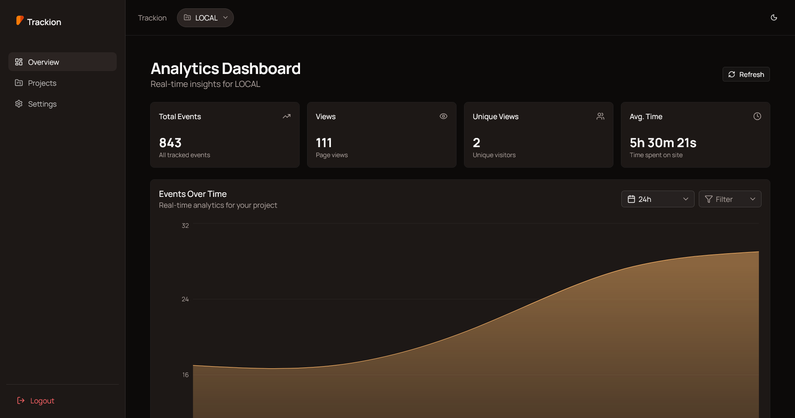

# Trackion

Trackion is a lightweight telemetry infrastructure for developers.

It helps you track events, understand how your product is used, and keep full control over your data -> without complex setup or vendor lock-in.

## Why Trackion?

Most analytics tools are:

- heavy and hard to setup
- expensive at scale
- or require sending your data to third parties

Trackion is built to be:

- simple to integrate
- fast and minimal
- self-hostable with full data ownership

---

## Features

- Event tracking (custom + automatic)
- Real-time analytics dashboard
- Session and user insights
- Lightweight SDK (minimal overhead)
- Self-host friendly (your data stays with you)
- hosted cloud (beta)

## Quick Example

Add Trackion to your app:

```html
<script
  src="https://api.trackion.tech/t.js"
  data-api-key="YOUR_API_KEY"
></script>
```

Track events:

```js
trackion.track("button.click", {
  label: "signup",
});
```

That’s it. Events will start appearing in your dashboard.

## Getting started

You can use Trackion in two ways:

- **Cloud (beta)** → quick start, no setup
  [https://trackion.tech/](https://trackion.tech/)

- **Self-hosted** → run on your own infrastructure

Guides:

- SaaS → [https://trackion.tech/docs/saas-guide/](https://trackion.tech/docs/saas-guide/)
- Self-host → [https://trackion.tech/docs/quick-start/](https://trackion.tech/docs/quick-start/)

## Screenshots

> Dashboard preview (more in docs)



## Notes

- Project is still in early stage, expect some changes
- APIs and features may evolve
- Self-hosting is recommended if you want full control

## Documentation

Full docs: [https://trackion.tech/docs/](https://trackion.tech/docs/)

## License & Usage

Trackion is open source under the MIT License.
You are free to use, modify, and self-host Trackion.

### Cloud vs Self-Hosted

Trackion is also offered as a hosted cloud service (currently in beta).

The open source version is fully functional for self-hosting.
The hosted version may include additional features, scaling, and managed services.

### Branding

"Trackion" and "P8labs" are trademarks of P8labs.
You may not use the Trackion name, logo, or branding for commercial purposes without permission.
