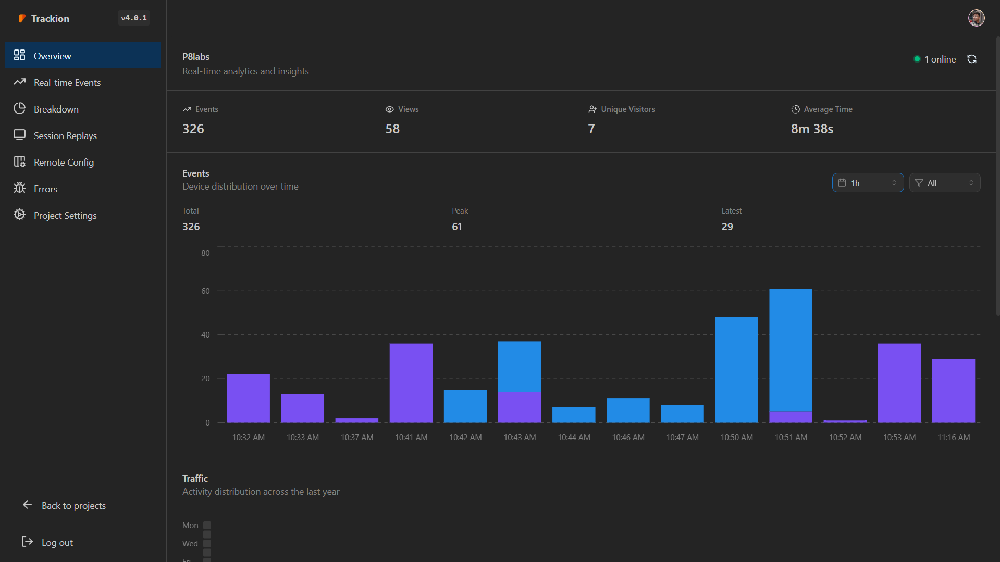

> [!WARNING]
>
> Trackion Cloud is shutting down
>
> Due to funding constraints, I've made the decision to discontinue the hosted Trackion Cloud service. Running a reliable cloud platform requires ongoing infrastructure costs that I can't sustainably support at this time.
>
> Trackion itself is not going away. The open-source/self-hosted version will continue to be available and remain the primary focus of development.
>
> If you're using Trackion Cloud, please export your data and migrate to a self-hosted deployment before the shutdown date. I'll provide migration documentation and support throughout the transition.
>
> Thank you to everyone who tried Trackion Cloud and supported the project.

# Trackion

Trackion is a lightweight telemetry infrastructure for developers.

It helps you track events, understand how your product is used, and keep full control over your data -> without complex setup or vendor lock-in.

## Why Trackion?

Most analytics tools are:

- heavy and hard to setup
- expensive at scale
- or require sending your data to third parties

Trackion is built to be:

- simple to integrate
- fast and minimal
- self-hostable with full data ownership

## Features

- **Event tracking** (custom + automatic)
- **Error tracking** (automatic capture + grouping)
- **Runtime control** (feature flags + remote config)
- **Real-time analytics dashboard**
- **Session and user insights**
- **Lightweight SDK** (minimal overhead)
- **Self-host friendly** (your data stays with you)
- **Hosted cloud** (beta)

## Quick Example

Add Trackion to your app:

```html
<script src="http://localhost:8000/t.js" data-api-key="YOUR_API_KEY"></script>
```

Track events:

```js
trackion.track("button.click", {
  label: "signup",
});
```

That’s it. Events will start appearing in your dashboard.

## Error Tracking

Trackion automatically captures JavaScript errors and unhandled promise rejections:

```js
// Automatic capture - no setup needed
window.onerror = (message, source, lineno, colno, error) => {
  // Trackion captures this automatically
};

// Manual capture
trackion.captureError(new Error("Something went wrong"), {
  userId: "user123",
  page: "checkout",
});
```

**Key Features:**

- **Automatic capture** of uncaught errors and promise rejections
- **Error grouping** by fingerprint (same errors grouped together)
- **Stack traces** with source file and line numbers
- **Context data** (URL, user ID, browser, custom data)
- **Deduplication** (prevents spam from repeated errors)
- **Dashboard integration** (view and debug errors in your analytics)

Errors appear in your dashboard under the "Errors" section, grouped by their fingerprint for easy debugging.

## Getting started

- **Self-hosted** → run on your own infrastructure
  [https://trackion.p8labs.in/docs/quick-start/](https://trackion.p8labs.in/docs/quick-start/)

## Screenshots



## Notes

- Project is still in early stage, expect some changes
- APIs and features may evolve
- Self-hosting is recommended if you want full control

## Documentation

Full docs: [https://trackion.p8labs.in/docs/](https://trackion.p8labs.in/docs/)

SDK examples are available in `examples/` for web, react, vue, node, and script integrations.

## Official SDK

- JavaScript SDK (official): [@trackion/js](https://www.npmjs.com/package/@trackion/js)
- Source: [P8labs/trackion-js](https://github.com/P8labs/trackion-js)

## License & Usage

Trackion is open source under the MIT License.
You are free to use, modify, and self-host Trackion.

### Cloud vs Self-Hosted

Trackion is also offered as a hosted cloud service (currently in beta).

The open source version is fully functional for self-hosting.
The hosted version may include additional features, scaling, and managed services.

### Branding

"Trackion" and "P8labs" are trademarks of P8labs.
You may not use the Trackion name, logo, or branding for commercial purposes without permission.

## Partners

Trackion is proudly sponsored by **Greptile** — The AI Code Reviewer.

Greptile automatically reviews pull requests, catches bugs before they reach production, and helps teams ship higher-quality code with AI-powered code reviews.

Learn more at **https://greptile.com**.
